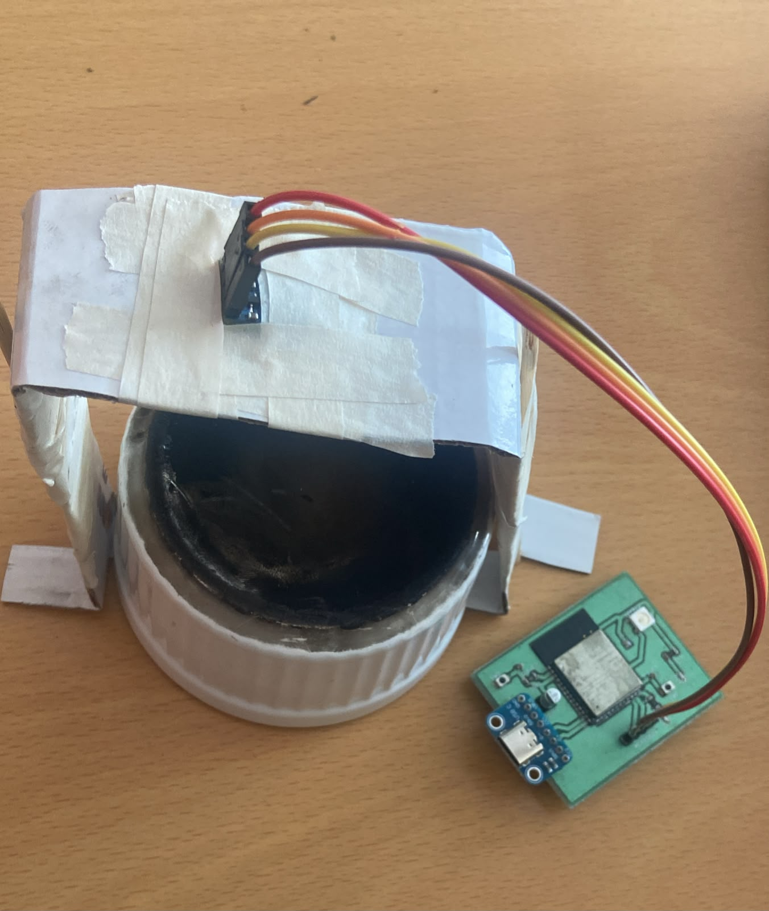

# Final Project: Distributed ESP32-S3 and Raspberry Pi Thermal Prediction System

## 1. Overview

The Final Project combines the custom ESP32-S3 PCB, the MLX90614 infrared sensor, a Raspberry Pi Zero 2 W, Bluetooth Low Energy, and TensorFlow Lite.

The ESP32-S3 is responsible for direct hardware interaction and real-time temperature publication. The Raspberry Pi is responsible for temporal feature capture, normalization, neural-network inference, and prediction return.

The final architecture is:

```text
MLX90614
    ↓ I2C
ESP32-S3 BLE server
    ↓ temperature notifications
Raspberry Pi BLE client
    ↓ 0–30 s feature capture
TensorFlow Lite inference
    ↓ remaining-time prediction
ESP32-S3 control characteristic
    ↓
Display, LED, alarm, or future actuator
```

The code should be stored as:

```text
ble/esp32/esp32_ble_server_final.ino
ble/raspberry/raspberry_ai_client_final.py
```

The repository does not currently include `arduino_model.tflite`. The Raspberry Pi code is documented, but inference cannot run until a compatible model is generated.

---

## 2. Final ESP32 Code

### 2.1 Included libraries

```cpp
#include <Wire.h>
#include <Adafruit_MLX90614.h>
#include <BLEDevice.h>
#include <BLEUtils.h>
#include <BLEServer.h>
```

`Wire` controls I2C. `Adafruit_MLX90614` reads the thermal sensor. The BLE libraries create a GATT server, service, characteristics, advertising, notifications, and write callbacks.

### 2.2 Pin definitions

```cpp
#define SDA_PIN 47
#define SCL_PIN 48
#define LED_PIN 45
```

GPIO 47 and GPIO 48 are used for the sensor I2C bus. GPIO 45 is configured as a digital output for the LED or demonstration control signal.

These pin numbers must match the PCB routing. Changing the code without checking the PCB can disconnect the software configuration from the actual hardware.

### 2.3 BLE objects

```cpp
BLECharacteristic *tempCharacteristic;
BLECharacteristic *controlCharacteristic;
```

`tempCharacteristic` sends temperatures from the ESP32 to the Raspberry Pi. `controlCharacteristic` receives a command or prediction from the Raspberry Pi.

### 2.4 Service and characteristic UUIDs

```text
Service UUID: 12345678-1234-5678-1234-56789abcdef0
Temperature:  12345678-1234-5678-1234-56789abcdef1
Control:      12345678-1234-5678-1234-56789abcdef2
```

These values must be identical in the Raspberry Pi program. A one-character difference prevents the client from finding the intended service or characteristic.

### 2.5 Control callback

```cpp
class ControlCallbacks : public BLECharacteristicCallbacks
```

The callback runs every time the Raspberry Pi writes to the control characteristic. The code obtains the received value and prints it.

The current implementation checks for:

```text
LED_ON
LED_OFF
```

and changes GPIO 45 accordingly.

This does not yet match the final Raspberry program. The Raspberry sends the remaining time as a number such as `481.68`. Therefore, the BLE write succeeds and the ESP32 prints the number, but neither `if` condition becomes true.

Two valid control strategies are possible:

**Numeric protocol:** the Raspberry sends seconds, and the ESP32 converts the text with `value.toFloat()`. The ESP32 decides when to activate the LED or actuator.

**Command protocol:** the Raspberry evaluates the threshold and sends `LED_ON` or `LED_OFF` instead of the number.

The project must select one protocol and use it consistently on both devices.

### 2.6 Setup sequence

The code starts serial communication at 115200 baud, configures the LED output, and initializes I2C with the PCB pins.

```cpp
Wire.begin(SDA_PIN, SCL_PIN);
```

`mlx.begin()` verifies that the sensor responds. If it fails, the program enters an infinite loop because no valid measurements can be produced.

The BLE device is initialized with the name:

```text
ESP32_SENSOR
```

The Raspberry Pi searches for this exact advertised name.

The server creates one service and two characteristics. The temperature characteristic supports read and notify. The control characteristic supports write and is connected to `ControlCallbacks`.

After the service starts, advertising begins and the ESP32 becomes discoverable.

### 2.7 Main loop

Each second, the ESP32 reads:

```cpp
float obj = mlx.readObjectTempC();
float amb = mlx.readAmbientTempC();
```

It creates a comma-separated packet:

```text
36.42,24.87
```

The first value is object temperature and the second is ambient temperature. The packet is printed locally, written to `tempCharacteristic`, and transmitted with `notify()`.

The code currently notifies every second regardless of whether a client is connected. A more robust version can track connection state and only notify subscribed clients.

---

## 3. Final Raspberry Pi Code

The final Raspberry program begins with:

```python
import asyncio
import time
from pathlib import Path

import numpy as np
import tensorflow as tf
from bleak import BleakClient, BleakScanner
```

`asyncio` allows BLE scanning, notification reception, queue processing, and reconnection without blocking the whole program. `time.monotonic()` measures elapsed time safely. `Path` locates the model relative to the script. `NumPy` prepares the model input. TensorFlow loads the Lite interpreter. Bleak provides the BLE client.

### 3.1 BLE configuration

```python
DEVICE_NAME = "ESP32_SENSOR"
```

The service and characteristic UUIDs match the ESP32 final code. `TEMP_UUID` is used for notifications and `CONTROL_UUID` is used for returning the prediction.

### 3.2 Experiment configuration

```python
MOMENTO_DIA = 2
START_DT = 3.0
START_CONFIRM_SAMPLES = 3
STOP_DT = 2.0
ALPHA_DT = 0.2
```

`MOMENTO_DIA` is one of the neural-network inputs and must be changed manually for morning, afternoon, or night.

A run begins only after the filtered thermal difference exceeds 3 °C for three consecutive measurements. This avoids starting from a single noisy sample.

After a prediction, the system waits until `dT` falls to 2 °C before allowing another run. This hysteresis separates the start and reset conditions.

`ALPHA_DT = 0.2` applies the same exponential filtering concept used in the standalone ESP32 code.

### 3.3 Normalization constants

The code contains `X_MEAN`, `X_STD`, `Y_MEAN`, and `Y_STD`. These constants describe the dataset used to train the loaded model.

The values currently written in the final Raspberry code do not match the statistics of the 42-sample CSV currently stored in the repository. Therefore, they must not be mixed with a newly trained model from the current dataset.

The correct deployment procedure is:

```text
1. Train the model from the selected CSV.
2. Save the generated arduino_model.tflite.
3. Copy the printed means and standard deviations.
4. Update the Raspberry constants.
5. Place the model beside the Raspberry script.
6. Validate the complete system.
```

### 3.4 `CapturaEnfriamiento` state machine

The class manages the temporal experiment. It has three states:

```text
esperando  → waiting for a valid start
capturando → collecting the 0–30 second features
predicho   → prediction already produced; waiting for reset
```

`reiniciar_corrida()` clears the timestamps and captured values but intentionally preserves the filter object state through the class structure. If a completely independent run is required, `dT_filtrado` can also be reset.

### 3.5 Filter update

```python
self.dT_filtrado = (
    ALPHA_DT * dT_raw
    + (1.0 - ALPHA_DT) * self.dT_filtrado
)
```

This is an exponential moving average. The newest sample contributes 20%, and the previous filtered value contributes 80%.

### 3.6 Start detection

In the `esperando` state, the code counts consecutive samples above `START_DT`. When the count reaches three, it stores:

```text
Tobj_0
Tamb_0
dT_0
```

and records the start time using `time.monotonic()`.

### 3.7 Temporal sample capture

The code checks the elapsed time and captures each checkpoint only once:

```text
dT_5  at or after 5 seconds
dT_10 at or after 10 seconds
dT_20 at or after 20 seconds
dT_30 at or after 30 seconds
```

Because notifications arrive approximately once per second, the actual capture may occur slightly after the exact timestamp. The code records the first available sample after each threshold.

### 3.8 Input-vector construction

When all values are available, the code builds:

```text
[
  momento_dia,
  Tobj_0,
  Tamb_0,
  dT_0,
  dT_5,
  dT_10,
  dT_20,
  dT_30
]
```

The returned tuple also includes the real elapsed time, which is required to calculate the remaining time after inference.

### 3.9 Model loading

`cargar_modelo()` searches for:

```text
arduino_model.tflite
```

in the same folder as the Python script. If the file does not exist, a `FileNotFoundError` is raised with the expected path.

The interpreter allocates the tensors and prints the input and output shapes. The expected shapes are:

```text
Input:  [1, 8]
Output: [1, 1]
```

The repository currently does not contain this model file. Its absence is intentional in the documentation, but it means that the final program cannot yet run inference from a fresh clone.

### 3.10 Model execution

`ejecutar_modelo()` normalizes the eight values, adds a batch dimension with `np.expand_dims`, places the array in the input tensor, invokes the interpreter, and reads the normalized output.

The total predicted time is calculated as:

```text
total_time = normalized_prediction × Y_STD + Y_MEAN
```

### 3.11 ESP32 discovery

`buscar_esp32()` repeatedly performs five-second scans. It prints each discovered name and address and returns only when a device named `ESP32_SENSOR` is found.

If the device is not found, the function waits two seconds and scans again.

### 3.12 Notification queue

The BLE notification callback should remain short. It copies the received bytes and places them in an `asyncio.Queue` using `loop.call_soon_threadsafe()`.

A separate coroutine performs decoding, parsing, feature capture, inference, and BLE writing. This prevents expensive processing from blocking the BLE callback.

### 3.13 Packet parsing

The program expects exactly two comma-separated values:

```text
Tobj,Tamb
```

If the packet contains a different number of fields, it is rejected. The values are converted to floats and sent to the capture state machine.

### 3.14 Total and remaining time

The model predicts the total time from the beginning of the run until `dT = 5 °C`. Since inference occurs after approximately 30 seconds, the code calculates:

```text
remaining_time = max(total_time - elapsed_time, 0)
```

This prevents a negative displayed result if the predicted total time is already less than the elapsed time.

### 3.15 Prediction return

The remaining time is encoded as UTF-8 text and written to `CONTROL_UUID` with a response request.

Example:

```text
481.68
```

As described earlier, the ESP32 callback must be modified if this numeric protocol is retained.

### 3.16 Connection and reconnection

`conectar()` creates the client, subscribes to notifications, starts the processing coroutine, and remains active while the BLE link exists.

If the link is lost, the context manager closes the connection, the processing task is cancelled, and the outer `main()` loop begins scanning again after error handling.

---

## 4. Required File Placement

The recommended current structure is:

```text
ble/
├── esp32/
│   ├── ble_client.ino
│   └── esp32_ble_server_final.ino
└── raspberry/
    ├── mlx_ble.py
    └── raspberry_ai_client_final.py
```

When generated, the model must be placed here:

```text
ble/raspberry/arduino_model.tflite
```

The model is not listed in the current repository structure because the user has not generated or committed it yet.

---

## 5. Installation Without `requirements.txt`

The packages can be installed directly:

```bash
pip install numpy tensorflow bleak
```

Then execute:

```bash
python ble/raspberry/raspberry_ai_client_final.py
```

The ESP32 code requires the ESP32 Arduino board package and the Adafruit MLX90614 library.

---

## 6. Current Integration Problems

### Missing TensorFlow Lite model

The final Raspberry script expects `arduino_model.tflite`, but the file is not currently in the repository. The training script must generate it before inference can run.

### Model-version mismatch

The normalization constants in the Raspberry script belong to a different dataset version than the current 42-sample CSV. The model and constants must be regenerated together.

### Control-message mismatch

The Raspberry writes a numeric remaining time, but the ESP32 only performs LED actions for `LED_ON` and `LED_OFF`. The protocol must be unified.

### Experimental uncertainty

The prediction quality depends on data collected under changing ambient conditions. Integration success does not by itself prove model accuracy.

---

## 7. Evidence

### PCB layout


### Final prototype



### Local demonstration video

[Watch the repository video](videos/Dise%C3%B1o%20final.mp4)

### External demonstration video

[Watch the external demo](https://drive.google.com/file/d/1Ku_SDlaufHtSQT0y7ulRh_jtI_WYhIBA/view?usp=sharing)

---

## 8. Conclusion

The final code implements the intended distributed architecture at the software level. The ESP32-S3 publishes sensor data and exposes a return channel. The Raspberry Pi manages the temporal experiment, prepares the neural-network input, executes TensorFlow Lite inference, and returns the result.
